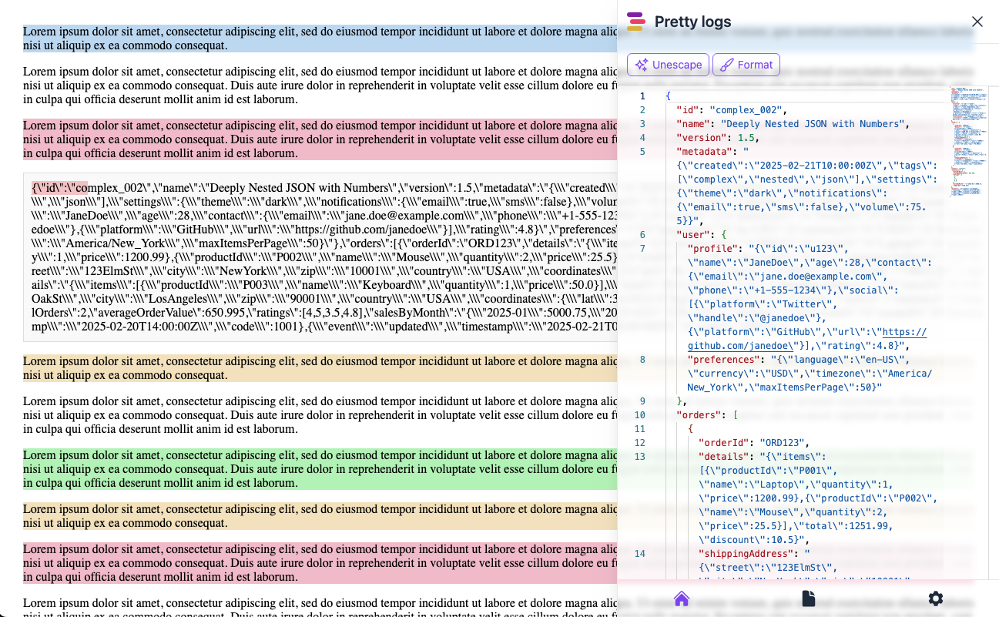

# Chrome Extension with Vite

## 🔥 Pretty Logs: Faster, Easier Log Checking!

**Pretty-Logs** is a Chrome extension designed to streamline logs checking by:

- 🔍 **Auto-Detecting JSON:** Select an opening bracket (**`[`** or **`{`**) to find and extract the complete JSON object.
- 🎨 **Unescape & Format:** Instantly convert raw logs into a clean, readable, and color-coded format.

Say goodbye to messy logs and boost your productivity with **Pretty Logs** — your new favorite tool!



## 🚀 Build extension

You can choose one of ways to build extension

### 📦 Build from Source

Requirements:

- Node.js >= 20
- npm or yarn

Get repository from Github and run command:

```bash
npm run build
# or
yarn build
```

After building, the output files will be available in the `pretty-logs-dist` folder.

### 📥 Download from GitHub

You can also download the pre-built `pretty-logs-dist` folder from the latest release on the GitHub repository.

## 🌐 Install Extension in Browsers

### 🟠 Chrome

1. Open Chrome and navigate to `chrome://extensions/`
2. Enable "Developer mode"
3. Click "Load unpacked"
4. Select the `pretty-logs-dist` folder

### 🦊 Firefox

1. Open Firefox and go to `about:debugging#/runtime/this-firefox`
2. Click "Load Temporary Add-on..."
3. Select the `manifest.json` file in the `pretty-logs-dist` folder

## 🔧 Development

### 📋 Requirements

- Node.js >= 20
- npm or yarn

### 🛠️ Run in Development Mode

```bash
npm install
npm run dev
# or
yarn install
yarn dev
```
